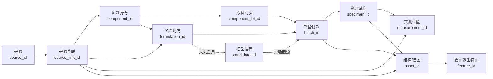

# 粘合剂推荐数据结构

> 状态：v1.0 目标结构讨论稿
>
> 本文件只定义数据关系、字段职责和质量规则，不包含任何真实合作数据。

## 1. 这份结构解决什么问题

现有 [v0.3 工作簿](templates/%E7%B2%98%E5%90%88%E5%89%82%E9%87%8D%E8%A6%81%E5%8C%96%E5%AD%A6%E6%80%A7%E8%B4%A8_%E6%95%B0%E6%8D%AE%E6%A0%BC%E5%BC%8F_v0.3.xlsx) 用于让导师和化学组确认粘合剂体系、重要字段和可获得数据。它仍然是正确的初步沟通材料，但不是最终机器学习数据库。

正式数据接口不能只回答“这个化学品有什么性质”，还必须连接完整实验链条：

```text
原料
→ 配方组成
→ 制备与固化批次
→ 胶接试样
→ 测试或结构表征
→ 原始结果
```

核心原则是：

> 任意一条性能数值、图像或谱图，都能追溯到具体配方、制备批次、物理试样、测试条件和数据来源。

## 2. 核心关系



一个配方可以包含多个原料身份，也可以制备多个批次；每个真实批次还要记录实际用了哪个供应商批次。一个批次可以产生多个试样。非破坏性测量可以在同一试样上重复进行；破坏性胶接测试的每个重复件必须使用独立的 `specimen_id`。

## 3. 编号规则

| 编号 | 代表对象 | 何时必须新建 |
|---|---|---|
| `component_id` | 一种原料身份/商品规格 | 化学身份、牌号或决定性商品规格改变；供应商批次变化不新建此编号 |
| `component_lot_id` | 一批实际收到并使用的原料 | 供应商、供应商批次或到货批次改变 |
| `formulation_id` | 一套名义配方 | 任一原料身份、名义配比或配方版本改变；只更换原料批次时不改变 |
| `batch_id` | 一次真实混合与固化批次 | 同一配方被重新制备 |
| `specimen_id` | 一个真实物理试样 | 新制作一块胶接试样或试片 |
| `replicate_group_id` | 一组按同一方案制作的重复试样 | 配方、批次、测试方案或重复实验组改变 |
| `measurement_id` | 一次原始测量 | 每个试样、性能或测量时点改变 |
| `asset_id` | 一份原始图像、谱图或曲线文件 | 每个文件或不可拆分的数据包独立编号 |
| `feature_id` | 从表征文件提取的一项特征 | 文件、特征名称或提取版本改变 |
| `source_id` | 一个来源实体 | DOI、实验记录或供应商资料改变 |
| `source_link_id` | 来源与数据对象的一次关联 | 来源、关联对象或证据位置改变 |
| `candidate_id` | 一次模型候选记录 | 每个主动学习轮次中的每个候选独立编号 |

编号只用于关联，不应把配方比例、性能值或个人姓名编码进编号。

## 4. 推荐的八个逻辑模块

下面是八个容易讨论的业务模块。为避免重复和关系歧义，正式 v1.0 工作簿中，原料批次、实际投料、表征特征和来源关联会拆成子表，因此物理工作表数量可能多于八个。v0.3 不要求一次完成所有子表。

### 01_原料组分

该模块至少分为两张子表：

- `01A_原料身份`：一行代表一种稳定的化学身份或商品规格；
- `01B_原料批次`：一行代表实验室实际收到的一批原料。

| 字段键 | 中文名称 | 填写方 | 要求 |
|---|---|---|---|
| `component_id` | 原料身份编号 | 共同确认 | 在 `01A` 中必填且唯一；在 `01B` 中作为必填外键 |
| `material_name` | 原料名称 | 化学组 | 必填，使用实验室实际名称 |
| `trade_name` | 商品名/牌号 | 化学组 | 有商品原料时填写 |
| `default_role` | 常见组分角色 | 化学组 | 树脂、固化剂、催化剂、填料、增韧剂、溶剂、偶联剂等 |
| `cas_number` | CAS号 | 化学组确认 | 有唯一小分子身份时填写 |
| `structure_status` | 结构可用状态 | 共同确认 | 可获得、部分可获得、未知、不适用 |
| `critical_property_*` | 本体系关键理化性质 | 化学组 | 只保留实测或有可靠来源的少量字段 |
| `canonical_smiles` | 规范 SMILES | 算法组生成、化学组审核 | 根据可靠身份生成，不能要求化学组手工编写 |
| `inchi_key` | InChIKey | 算法组 | 能确定结构时生成 |
| `structure_source` | 结构来源 | 算法组 | 数据库、供应商或论文来源 |
| `descriptor_version` | 描述符版本 | 算法组 | 计算 RDKit/Mordred/ECFP 时记录软件与参数 |
| `component_lot_id` | 原料批次编号 | 化学组 | 在 `01B` 中必填且唯一 |
| `supplier` | 供应商 | 化学组 | 在 `01B` 中记录 |
| `supplier_lot` | 供应商批次 | 化学组 | 可获得时填写 |
| `received_date` | 到货日期 | 化学组 | 可获得时填写 |
| `lot_quality_note` | 批次质量备注 | 化学组 | 记录证书、储存或异常信息 |

`critical_property_*` 不是无限增加所有可能性质。具体保留哪些列，要在粘合剂体系和预测目标确认后由化学组决定。会随供应商批次变化的实测性质应关联 `component_lot_id`，不能误当成永久的化学身份属性。

### 02_配方组成

一行代表“某个名义配方中的一种原料身份”，因此同一个 `formulation_id` 通常会出现多行。这里只保存名义组成，不保存实际使用的供应商批次。

| 字段键 | 中文名称 | 填写方 | 要求 |
|---|---|---|---|
| `formulation_id` | 配方编号 | 共同确认 | 必填 |
| `component_id` | 原料编号 | 共同确认 | 必须能在 `01_原料组分` 中找到 |
| `component_role` | 该配方中的作用 | 化学组 | 必填 |
| `nominal_amount_value` | 名义用量数值 | 化学组 | 与口径分开保存 |
| `amount_basis` | 配比口径 | 化学组 | `wt%`、`phr`、`mol%`、当量比等 |
| `formulation_version` | 配方版本 | 共同确认 | 配方修改时递增 |
| `formulation_notes` | 配方备注 | 化学组 | 只记录无法结构化表达的信息 |

同一配方内的所有用量必须使用可解释的共同口径。不能把 `phr`、质量百分比和摩尔比混在同一列。
同一配方中的 `(formulation_id, component_id, component_role)` 组合原则上唯一；如果同一原料以不同阶段加入，应在正式字段字典中增加阶段键。

### 03_制备固化

该模块分为：

- `03A_制备批次`：一行代表一次真实混合与固化批次；
- `03B_批次投料`：一行代表某批次实际使用的一批原料。

| 字段键 | 中文名称 | 填写方 | 要求 |
|---|---|---|---|
| `batch_id` | 制备批次编号 | 化学组 | 在 `03A` 中必填且唯一；在 `03B` 中作为必填外键 |
| `formulation_id` | 名义配方编号 | 化学组 | 在 `03A` 中必填 |
| `preparation_date` | 制备日期 | 化学组 | 建议使用 `YYYY-MM-DD` |
| `mixing_sequence` | 混合顺序 | 化学组 | 必填或注明未知 |
| `mixing_temperature_c` | 混合温度 | 化学组 | 数值列，不在单元格中写单位 |
| `mixing_time_min` | 混合时间 | 化学组 | 数值列 |
| `mixing_speed_rpm` | 混合转速 | 化学组 | 适用时填写 |
| `degassing_method` | 脱泡方法 | 化学组 | 真空、离心或其他 |
| `degassing_time_min` | 脱泡时间 | 化学组 | 适用时填写 |
| `cure_temperature_c` | 固化温度 | 化学组 | 必填或注明条件不适用 |
| `cure_time_min` | 固化时间 | 化学组 | 必填或注明条件不适用 |
| `cure_pressure_mpa` | 固化压力 | 化学组 | 适用时填写 |
| `post_cure_protocol` | 后固化方案 | 化学组 | 有后固化时填写 |
| `batch_status` | 批次状态 | 化学组 | 成功、部分成功、失败 |
| `batch_notes` | 批次异常记录 | 化学组 | 记录偏离方案、污染或操作异常 |
| `component_lot_id` | 实际原料批次 | 化学组 | 在 `03B` 中必填，必须能在 `01B` 找到 |
| `actual_amount_value` | 实际投料数值 | 化学组 | 在 `03B` 中填写 |
| `actual_amount_basis` | 实际投料口径 | 化学组 | 应能与名义配方比较 |
| `addition_order` | 实际加料顺序 | 化学组 | 在 `03B` 中填写 |

如果固化过程包含多个温度阶段，应使用结构化的阶段记录或单独的固化程序文件，不能只留下“按常规固化”。
`03B` 中的 `(batch_id, component_lot_id, addition_order)` 应能唯一定位一次实际投料。

### 04_胶接试样

一行代表一个真实物理试样。

| 字段键 | 中文名称 | 填写方 | 要求 |
|---|---|---|---|
| `specimen_id` | 试样编号 | 化学组 | 必填且唯一 |
| `batch_id` | 制备批次编号 | 化学组 | 必填 |
| `replicate_group_id` | 重复实验组编号 | 化学组 | 同一方案下的重复件使用同一编号 |
| `replicate_index` | 重复件序号 | 化学组 | `1, 2, 3...` |
| `substrate_1` | 基材1 | 化学组 | 胶接性能任务必填 |
| `substrate_2` | 基材2 | 化学组 | 胶接性能任务必填 |
| `substrate_grade` | 基材牌号 | 化学组 | 可获得时填写 |
| `surface_treatment` | 表面处理 | 化学组 | 清洗、打磨、等离子、底涂等 |
| `surface_roughness` | 表面粗糙度 | 化学组 | 实测时填写并单列单位 |
| `primer` | 底涂 | 化学组 | 使用时填写 |
| `bondline_thickness_mm` | 胶层厚度 | 化学组 | 胶接性能任务建议必填 |
| `joint_geometry` | 接头形式 | 化学组 | 搭接、T形、对接等 |
| `specimen_dimensions` | 试样尺寸 | 化学组 | 应能对应测试标准 |
| `specimen_status` | 试样状态 | 化学组 | 合格、缺陷、报废 |

胶接强度不是粘合剂本体的单一属性。基材、界面、胶层厚度和接头几何必须与性能结果同时保存。

搭接剪切、剥离等破坏性测试中，一个试样只能被破坏一次。三个平行重复件必须建立三个不同的 `specimen_id`，再用同一个 `replicate_group_id` 说明它们属于同一重复实验组，不能把同一试样写成三次重复测试。

### 05_实测性能

一行代表一个试样的一次原始测试。重复实验不能只保存平均值。

| 字段键 | 中文名称 | 填写方 | 要求 |
|---|---|---|---|
| `measurement_id` | 测量编号 | 化学组 | 必填且唯一 |
| `specimen_id` | 试样编号 | 化学组 | 必填 |
| `property_name` | 性能名称 | 共同确认 | 使用受控名称 |
| `raw_value` | 原始实测值 | 化学组 | 不填单位和文字 |
| `unit` | 单位 | 共同确认 | 同一任务必须统一 |
| `measurement_timepoint` | 测量时点 | 化学组 | 同一试样允许非破坏性重复测量时填写 |
| `test_standard` | 测试标准 | 化学组 | ASTM、ISO、GB/T或实验室协议 |
| `test_temperature_c` | 测试温度 | 化学组 | 必填或注明未知 |
| `test_humidity_rh` | 测试湿度 | 化学组 | 适用时填写 |
| `loading_rate` | 加载速率 | 化学组 | 与单位分开保存 |
| `aging_condition` | 老化条件 | 化学组 | 温度、湿度、介质和时长应可追溯 |
| `failure_mode` | 失效模式 | 化学组 | 界面、内聚、基材或混合失效 |
| `failure_mode_fraction` | 失效比例 | 化学组 | 能量化时填写 |
| `measurement_valid` | 是否有效 | 化学组 | `true/false` |
| `invalid_reason` | 无效原因 | 化学组 | 无效时必填 |

均值、标准差和保持率属于派生结果，应由读取脚本从原始重复值计算，并记录计算版本。

### 06_结构与表征

该模块分为：

- `06A_表征资产`：一行代表一份原始图像、谱图、曲线或不可拆分的数据包；
- `06B_表征特征`：一行代表从某一资产提取的一项数值或分类特征。

| 字段键 | 中文名称 | 填写方 | 要求 |
|---|---|---|---|
| `asset_id` | 表征文件编号 | 共同确认 | 在 `06A` 中必填且唯一；在 `06B` 中作为必填外键 |
| `batch_id` | 关联批次 | 化学组 | 批次级表征时填写 |
| `specimen_id` | 关联试样 | 化学组 | 试样级表征时填写 |
| `modality` | 表征类型 | 化学组 | SEM、光学、CT、FTIR、DSC、DMA、流变等 |
| `controlled_location` | 受控文件位置 | 共同确认 | 未授权原始文件不得放入公开仓库 |
| `instrument` | 仪器型号 | 化学组 | 可获得时填写 |
| `acquisition_settings` | 采集参数 | 化学组 | 放大倍数、扫描范围、升温速率等 |
| `sampling_location` | 采样位置 | 化学组 | 断口、界面、胶层内部等 |
| `feature_id` | 派生特征编号 | 算法组 | 在 `06B` 中必填且唯一 |
| `derived_feature_name` | 派生特征名称 | 算法组 | 孔隙率、缺陷尺寸、峰值等 |
| `derived_feature_value` | 派生特征值 | 算法组 | 与单位和算法版本分开保存 |
| `derived_feature_unit` | 派生特征单位 | 算法组 | 数值特征适用时填写 |
| `extraction_version` | 特征提取版本 | 算法组 | 记录软件、模型和参数 |

`06A` 中 `batch_id` 和 `specimen_id` 至少有一个非空；二者同时存在时，该试样必须属于所填批次。一个 `asset_id` 可以对应多行 `06B` 特征。只有属于同一个批次或试样的数据才可以作为成对多模态样本，不能把不同论文中互不对应的图片、工艺和性能强行配对。

### 07_来源与质量

该模块分为：

- `07A_来源`：一行代表一个唯一来源；
- `07B_来源关联`：一行代表来源与某个数据对象之间的一次关联；
- `07C_缺失记录`：一行说明某个对象的某个字段为什么缺失。

| 字段键 | 中文名称 | 填写方 | 要求 |
|---|---|---|---|
| `source_id` | 来源编号 | 共同确认 | 在 `07A` 中必填且唯一；在 `07B` 中作为必填外键 |
| `source_type` | 来源类型 | 数据产生方确认 | 实验记录、论文、补充材料、供应商等 |
| `doi_or_url` | DOI或链接 | 算法组整理 | 文献或公开来源时填写 |
| `sharing_permission` | 共享权限 | 数据所有方确认 | 公开、组内、受限或未知 |
| `source_link_id` | 来源关联编号 | 共同确认 | 在 `07B` 中必填且唯一 |
| `subject_type` | 关联对象类型 | 共同确认 | 在 `07B` 和 `07C` 中填写：原料、配方、批次、试样、测量或表征 |
| `subject_id` | 关联对象编号 | 共同确认 | 在 `07B` 和 `07C` 中必须能找到对应对象 |
| `table_or_figure` | 表格/图/页码 | 算法组整理 | 支持精确复核 |
| `value_status` | 数值状态 | 共同确认 | 原始、单位换算、图中读取、推算 |
| `conversion_note` | 换算说明 | 算法组 | 有单位换算或派生时填写 |
| `review_status` | 审核状态 | 共同确认 | 未审核、已复核、存在疑问 |
| `quality_note` | 质量备注 | 共同确认 | 记录不确定性和可比性问题 |
| `missing_record_id` | 缺失记录编号 | 算法组 | 在 `07C` 中必填且唯一 |
| `field_key` | 缺失字段键 | 算法组 | 必须对应字段字典 |
| `missing_reason_code` | 缺失原因代码 | 数据产生方确认 | 使用第6节受控代码 |
| `missing_note` | 缺失补充说明 | 数据产生方 | 必要时填写 |

同一个 `source_id` 可以通过多条 `07B` 关联到多个对象，不要为了关联不同数值而重复创建同一篇论文或同一份实验记录。

### 08_模型推荐记录

该表只在候选空间和实验回流流程获得导师确认后启用。它不是化学组当前必填表。

| 字段键 | 中文名称 | 填写方 | 要求 |
|---|---|---|---|
| `candidate_id` | 候选编号 | 算法组 | 必填且唯一 |
| `formulation_id` | 候选配方编号 | 算法组 | 必填 |
| `iteration` | 主动学习轮次 | 算法组 | 从预定义轮次开始 |
| `model_version` | 模型版本 | 算法组 | 必填 |
| `target_name` | 预测目标 | 算法组 | 与正式任务一致 |
| `predicted_mean` | 预测均值 | 算法组 | 与单位分开保存 |
| `predicted_uncertainty` | 预测不确定性 | 算法组 | 必须说明计算方法 |
| `acquisition_score` | 采集分数 | 算法组 | 记录公式与参数版本 |
| `diversity_group` | 多样性分组 | 算法组 | 使用聚类时填写 |
| `constraint_status` | 约束检查 | 共同确认 | 成本、安全、黏度、可采购性、可加工性等 |
| `selection_reason` | 入选原因 | 算法组 | 高性能、高不确定性、多样性或对照 |
| `experiment_status` | 实验状态 | 化学组 | 待确认、已选、制备中、完成、失败 |

模型推荐不能覆盖真实实验值。完成实验后，应新建 `batch_id`、`specimen_id` 和 `measurement_id`，再把结果作为新证据回流。

## 5. 谁负责填写什么

### 化学组负责

- 实际使用的原料名称、牌号、供应商批次和组分角色；
- 真实投料值、配比口径、混合、脱泡、固化和后固化条件；
- 基材、表面处理、胶层厚度、试样几何和测试条件；
- 每个重复实验的原始值、异常、失效模式和实验状态；
- 图像、谱图和曲线属于哪个批次或试样；
- 审核算法组整理的化学身份和结构映射是否对应真实原料。

### 算法组负责

- 规范 SMILES、InChIKey、分子描述符、指纹及其软件版本；
- 文献链接、表格/图号、单位换算和初步来源质量标记；
- 数据完整性检查、重复检查、派生统计和建模视图；
- 分组划分、模型版本、预测值、不确定性和候选选择记录。

### 需要共同确认

- 粘合剂化学体系和研究边界；
- 唯一主要预测目标、单位和测试方法；
- 关键理化性质的最小集合；
- 编号规则和缺失原因；
- 哪些配方和批次可以用于训练、验证和最终测试。

共享权限必须由数据产生方或数据所有方确认。化学组不需要手工填写 SMILES、ECFP、RDKit/Mordred 描述符或模型向量，但必须确认算法组使用的结构是否与真实原料一致。

## 6. 缺失值规则

数值缺失时保留为空，并在 `07C_缺失记录` 中填写对象编号、字段键和受控原因代码。不能用 `0`、`-1`、`无` 或猜测值代替缺失数据。

| 缺失代码 | 中文含义 |
|---|---|
| `NOT_MEASURED` | 未进行测量 |
| `NOT_REPORTED` | 来源没有报告 |
| `NOT_APPLICABLE` | 对当前对象不适用 |
| `EXPERIMENT_FAILED` | 实验或仪器失败 |
| `UNKNOWN` | 当前无法判断 |

`0` 只能表示真实测得或有明确物理含义的零值。

v0.3 尚未实现独立缺失表时，数值单元格仍保持为空，并把“未测量/未知”等原因写入说明或备注列，不能把文字写进数值列。

## 7. 数值、字段角色和重复实验规则

1. 数值和单位使用不同列，例如 `raw_value=12.4`、`unit=MPa`。
2. 同一预测任务冻结唯一单位；单位换算要保留原值、换算值和换算规则。
3. 质量分数、`phr`、摩尔比和当量比必须标明口径。
4. 破坏性测试的每个重复件保存独立的 `specimen_id` 和 `measurement_id`，并通过 `replicate_group_id` 归组。
5. 均值、标准差、保持率和综合评分属于派生数据，不覆盖原始值。
6. 分类字段使用受控词表，避免同时出现“环氧”“Epoxy”“EP”等同义写法。
7. 日期使用 ISO 格式；布尔值使用 `true/false`；数值单元格不混入文字。

冻结 v1.0 时，还要为每个字段建立字段字典：

| 字段字典项 | 用途 |
|---|---|
| `field_key` | 唯一机器字段名 |
| `data_type` | 数值、分类、文本、日期或布尔值 |
| `unit` | 标准单位 |
| `owner` | 化学组、算法组或共同确认 |
| `feature_role` | 候选输入、预测目标、编号、测试后信息或仅审计 |
| `available_at_prediction` | 做出预测时该字段是否已经可获得 |
| `allowed_values` | 分类字段的受控取值 |
| `missing_allowed` | 是否允许缺失以及适用原因 |

`failure_mode`、`failure_mode_fraction`、`measurement_valid` 和 `invalid_reason` 都是在测试后才知道的信息。预测测试前性能时，它们只能用于结果分析和质量审计，不能作为模型输入。

## 8. 原始层与建模层分开

原始数据应保持不可覆盖。算法读取时再生成经过检查的建模视图：

```text
raw/
  不修改的原始工作簿、图像、谱图和实验记录

processed/
  单位统一、字段映射、质量标记和派生特征

model_view/
  针对一个明确预测任务生成的一行一个测量或样品的训练表
```

受限真实数据的实际存储位置由合作组决定；上述目录名称只表达逻辑层次，不代表应把真实文件提交到公开 GitHub。

## 9. 数据划分与防泄漏

- 同一 `formulation_id` 的重复试样原则上放在同一数据分组；
- 同一 `batch_id` 的多个试样不能跨训练集和测试集；
- 同一 `specimen_id` 的不同 SEM 图块、谱图片段或重复测量不能跨分组；
- 需要评估新化学结构时，按骨架、树脂/固化体系或配方族分组；
- 插补、标准化、特征选择和降维只能在每个训练折内拟合，再应用到对应验证折；
- `available_at_prediction=false` 的测试后信息不能进入模型输入；
- 失败实验应保留失败状态；缺失标签不能通过普通均值或中位数插补伪造成实测性能；
- 测试集只在任务、字段、预处理和模型选择规则冻结后使用；
- `split` 属于派生建模信息，不写回不可变的原始实验记录。

随机逐行切分通常会高估模型对新配方、新批次或新材料体系的能力。

## 10. 从 v0.3 到 v1.0 的顺序

1. 使用 v0.3 与导师和化学组确认粘合剂大类、唯一预测目标和可获得字段。
2. 用 3–5 条获授权真实样例检查含义、单位和缺失规则，不进行模型比较。
3. 确认“名义配方 → 原料批次与制备批次 → 重复试样 → 单次测量”的编号链。
4. 删除与当前体系无关的条件字段，补充该体系特有字段。
5. 冻结 v1.0 字段字典、单位和受控词表。
6. 数据量和模态达到要求后，才启用结构描述符、多模态表征或主动学习记录。

v1.0 不要求一次拥有全部模块和子表。核心最低要求是：

- 能追溯的原料批次、配方、制备批次、重复试样和测量编号；
- 组分及配比；
- 制备、固化、基材、界面和测试条件；
- 原始重复性能值、单位、来源和缺失原因。

## 11. 数据安全边界

- 未经授权的真实配方、实验记录、图像和谱图不得提交到公开仓库；
- 供应商保密结构不能因为模型需要而猜测或反推后公开；
- 公开文献数据必须保存 DOI、表格/图号和使用许可；
- 脱敏样例仍需确认不会泄露配方、批次或合作方身份；
- 模型预测不是实验事实，必须保存在独立的推荐记录中。
